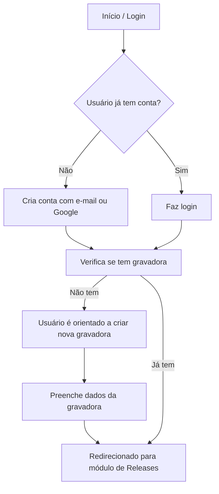
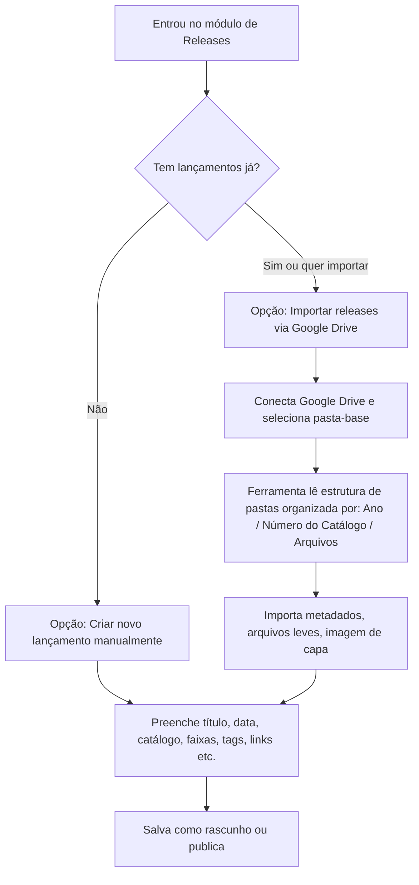

# User Flow

## Onboarding Inicial

## Módulo de Gravadoras

- Se o usuário possui mais de uma label, ele escolhe qual vai gerenciar no momento (pode alternar a qualquer hora)
- Após a escolha, o sistema carrega todos os dados associados àquela gravadora (artistas, releases, documentos etc.)

## Cadastro e Importação de Releases

## Fluxo nos Outros Módulos

- **Artistas:** Cadastrar manualmente ou importar via CSV (futuramente)
- **Mixtapes:** Upload ou link externo, com definição de artista e data
- **Documentos:** Upload direto ou arrastar arquivos (contratos, notas etc.)
- **Demos:** Visualizar, escutar e mudar status (novo, aceito, recusado)
- **Calendário:** Visualizar datas vinculadas a releases, mixtapes, demos

## Observações

- Importação via Drive será opcional, com suporte a estrutura padronizada de pastas
- O login pode ser pulado em ambiente de desenvolvimento (dev mode)
- O fluxo será estendido conforme surgirem novos módulos (ex: analytics, promo)
